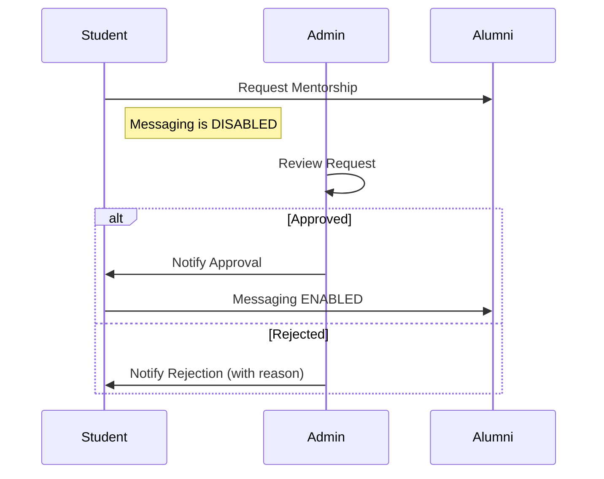
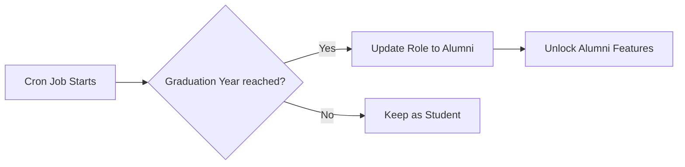

# 🎓 Alumni Connect: Advanced Management Portal

[](https://github.com/aadish8206/allumni-management-portal)
[](https://reactjs.org/)
[](https://nodejs.org/)
[](https://www.mongodb.com/)

**Alumni Connect** is a sophisticated networking ecosystem designed for higher education institutions. It automates administrative tasks while providing a secure, moderated platform for professional growth.

---

## 📖 Table of Contents
- [Core Features](#-core-features)
- [Workflow Visualizations](#-workflow-visualizations)
- [System Architecture](#-system-architecture)
- [API Reference](#-api-reference)
- [Installation & Setup](#-installation--setup)
- [Environment Variables](#-environment-variables)
- [Troubleshooting](#-troubleshooting)

---

## 🚀 Core Features

### 👨‍🎓 Automated Student-to-Alumni Transition
- **Background Logic**: A daily `node-cron` job checks graduation years.
- **Auto-Promotion**: Students are instantly switched to "Alumni" role upon graduation, unlocking the job posting and LinkedIn sync features.

### 🛡️ Admin-Gate Networking (Security First)
- **Moderated Communication**: Direct messaging between students and alumni is disabled until an Admin approves a specific connection request.
- **Mentorship Oversight**: Admins can view mentee profiles and reject/approve connections based on institutional guidelines.

### 💼 Referral-Linked Job Board
- **Actionable Referrals**: Students can view job posts and click "Request Referral" to initiate a moderated connection with the alumni poster.
- **Job Types**: Support for Internships, Full-time Jobs, and Referral-only listings.

### 🔄 Free LinkedIn Profile Sync
- **Manual Sync Helper**: A cost-free synchronization tool for alumni to update their current professional status (Company, Title, Skills) directly in the portal.

---

## 📊 Workflow Visualizations

### Mentorship Approval Flow


### Auto-Transition Flow


---

## 📂 System Architecture

```text
├── backend/
│   ├── models/          # User, Job, Mentorship, Resource, Donation, Campaign
│   ├── routes/          # authRoutes, userRoutes, jobRoutes, mentorshipRoutes, etc.
│   ├── services/        # cronService.js (Automation), emailService.js (Notifications)
│   └── server.js        # Entry point & DB connection
└── frontend/
    ├── src/
    │   ├── context/     # AuthContext (JWT Handling)
    │   ├── pages/       # AdminPortal, StudentPortal, AlumniPortal, Login, Register
    │   └── index.css    # Premium Design Tokens & Theme
```

---

## 📡 API Reference (Partial)

| Method | Endpoint | Description | Auth Required |
| :--- | :--- | :--- | :--- |
| **POST** | `/api/auth/register` | Register a new user | No |
| **POST** | `/api/auth/login` | Login and receive JWT | No |
| **GET** | `/api/users/directory` | Fetch alumni with filters | Yes |
| **PUT** | `/api/mentorship/:id/request` | Student requests mentorship | Yes (Student) |
| **PUT** | `/api/mentorship/admin/approve/:id` | Admin approves request | Yes (Admin) |
| **POST** | `/api/jobs` | Alumni posts a new job | Yes (Alumni) |

---

## 🚦 Installation & Setup

### 1. Clone & Dependencies
```bash
git clone https://github.com/aadish8206/allumni-management-portal.git
cd allumni-management-portal
# Install for both
cd backend && npm install
cd ../frontend && npm install
```

### 2. Configure .env
Create `.env` in the `backend/` folder:
```env
MONGODB_URI=mongodb+srv://...
JWT_SECRET=your_jwt_secret
SMTP_USER=your_gmail@gmail.com
SMTP_PASS=your_app_password
```

### 3. Run Locally
```bash
# Backend
npm run dev
# Frontend
npm run dev
```

---

## 🔐 Environment Variables

| Variable | Description |
| :--- | :--- |
| `MONGODB_URI` | Your MongoDB Atlas connection string. |
| `JWT_SECRET` | Secret key for signing login tokens. |
| `SMTP_PASS` | 16-character Google App Password for emails. |
| `EMAIL_PASS` | (Render Only) Alternative for SMTP_PASS. |

---

## 🛠️ Troubleshooting

- **CORS Errors**: Ensure the `VITE_API_URL` in frontend `.env` matches your backend URL.
- **Email 535 Error**: Ensure you are using a **Google App Password**, not your regular Gmail password.
- **MongoDB Connection**: Whitelist `0.0.0.0/0` in MongoDB Atlas Network Access if deploying to Render.

---

**Developed for Institutions committed to lifelong Alumni Engagement.**
